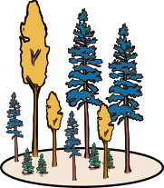

# Disentangeling future effects of climate change and forest disturbance on vegetation composition and land-surface properties of the boreal forest 

This repository contains code and data needed to reproduce the data analysis and figures of the paper *Disentangeling future effects of climate change and forest disturbance on vegetation composition and land-surface properties of the boreal forest* by Layritz et al., currently submitted to *Global Change Biology* &#x1F332; &#x1F333;

Per default, this repository will contain only the `final` data used to generate the figures. All other processing steps can be downloaded from [Zenodo](https://zenodo.org/records/10619524). The  scripts that generated the subsets from the raw data can equally be found on [Zenodo](https://zenodo.org/records/10619524). They were run on the High-Performance Computing (HPC) infrastructure and I can't guarantee that they'll run on another machine.

**The data will be available once the paper is accepted for publication.**

## Reproducing analysis

The repository is wrapped in a Docker container to ensure all libraries are installed in the correct version. If you want to reproduce the analysis using Docker, install it first and then run the following

1. Generating the Docker image using `sudo docker build --build-arg WHEN=2023-10-09 -t disturbance_boreal_lpj .` This should be done only once

2. Run the Docker container with `sudo docker run disturbance_boreal_lpj`. If everything works fine, this will return you to the terminal

3. Execute code: To redraw the figures run `RScript code/run_plots.R`. To recreate final data run `RScript code/create_final_data.R` To recreate processed data run `RScript code/create_processed_data.R`. 

The data analysis is per default parallelized on four cores. 

### to-do

- [ ]  customize to enable sequential processing

## Folder structure

The folder structure is as follows:

├── **code** &#x1F4C1;

│&nbsp; &nbsp; &nbsp; &nbsp;└──  `util_*.R`&#x1F4C4; *various helper functions*

│&nbsp; &nbsp; &nbsp; &nbsp;└──  `*_subset_processed.R`&#x1F4C4; *creates processed data from subset*

│&nbsp; &nbsp; &nbsp; &nbsp;└──  `*_processed_final.R`&#x1F4C4; *creates final data from processed*

│&nbsp; &nbsp; &nbsp; &nbsp;└──  `*_plot.R`&#x1F4C4; *create figures from final data*

├── **data** &#x1F4C1;  *model output on various steps of processing*
  
│&nbsp; &nbsp; &nbsp; &nbsp;└── subset &#x1F4C1;  *Subsets of the raw data generated before downloading to local. Can be downloaded from [Zenodo](https://zenodo.org/records/10619524) (approx 2G of data)*
  
│&nbsp; &nbsp; &nbsp; &nbsp;└── processed &#x1F4C1; *generated by `*_subset_processed.R` from the subset data*
  
│&nbsp; &nbsp; &nbsp; &nbsp;└── final &#x1F4C1;  *The data directly underlying the figures, generated with  `*_processed_final.R`*

│&nbsp; &nbsp; &nbsp; &nbsp;│&nbsp; &nbsp; &nbsp; &nbsp;└── shp &#x1F4C1; *The shapefiles used for plotting maps.*

│&nbsp; &nbsp; &nbsp; &nbsp;└── ext &#x1F4C1;  *External helper files*
  
├── **plots** &#x1F4C1; *Contains all the plots of the paper. The plots are generated by the scripts `*_plot.R`.*

├── dockerfile &#x1F4C4;
 

  
